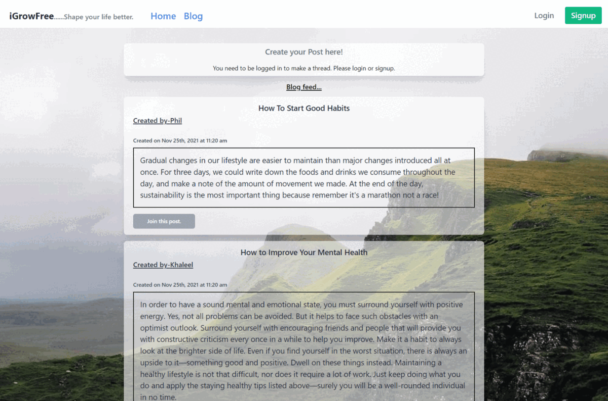

# 
iGrowFree

# Description

This application aims at the users who are struggling to keep track on their habits. With this application the user can choosee the lifestyle tehy want to pursue and add thehabits that they want to keep the track of. User can have multiple habits and the app lets the user to see the progress that they are performing for their habits.

# Table of Contents

- [iGrowFree](#iGrowFree)
- [Description](#description)
- [Table of Contents](#table-of-contents)
- [Installation](#installation)
- [Dependencies](#dependencies)
- [Usage](#usage)
- [Contributing](#contributing)
- [Licenses](#licenses)
- [Tests](#tests)
- [Technologies Used](#technologies-used)
- [Questions](#questions)
- [Screenshot](#screenshot)

# Installation

This app does not require an installation, and can be accessed via a web browswer at [here](https://teach-through-talk.herokuapp.com/).

However, if you would like to have this app forked, do `npm install` at the root directory and then run `npm start`

# Dependencies

This application requires react, express, graphql, tailwindcss, apollo-server-express, bycrypt, jsonwebtoken, mongoose, jwt-decode and craco

# Usage

Users can select the lifestyle and create multiple habits to keep track on also communicate with other users with the help of the blog section where users can create a post and comment on the others post as well. users can do this once they've signed up via [here](https://teach-through-talk.herokuapp.com/).

# Contributing

1. [Filip](https://github.com/FilipAlH)
2. [Phil](https://github.com/ptantsidis)
3. [Khaleel](https://github.com/khaleelpaul-green)
4. [Romal](https://github.com/romzzp)

# Licenses

Click [here](https://choosealicense.com/licenses/mit) for MIT license information

# Tests

N/A

# Technologies Used

This application uses the following technologies: React, Tailwind css, Node, Express, MongoDb, Heroku.

# Questions

Github: [This Repo](https://github.com/FilipAlH/iGrowFree)
Email: Please visit our respective Github pages.

Please feel free to contact us with comments or further questions via email, which is our prefered method.

# Screenshots

